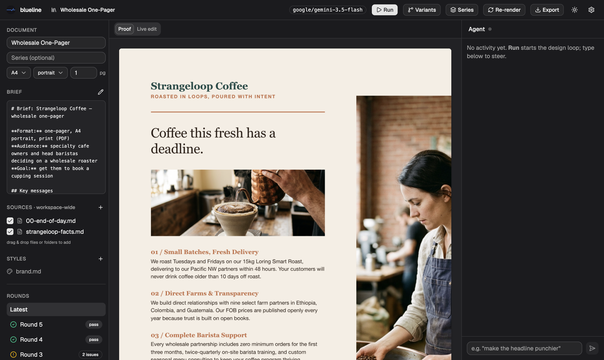

<p align="center">
  
</p>

<h1 align="center">Blueline</h1>

<p align="center">
  Print-ready marketing collateral, designed and press-checked by an agent.<br/>
  <em>A blueline is the final proof a printer hands you to sign off — this app produces it.</em>
</p>

<p align="center">
  
</p>

## What it does

You write a brief — audience, message, format. An embedded coding agent designs a
self-contained print-CSS HTML page, generates imagery, renders a PDF proof, and submits it
to a vision-model reviewer that press-checks it: composition, brand adherence, pagination,
dead space, page count. The agent fixes what the reviewer flags and goes again, round after
round, until the proof passes. Then you take over in a live editor — rewrite copy inline,
swap or re-generate photos, pan/zoom crops, nudge blocks by the millimetre — and export a
print-ready PDF that is pixel-identical to the preview.

## Features

- **Autonomous design loop** — draft → generate images → render → vision review → fix,
  with a hard round cap. Reviews are archived per round (JSON + PDF + page state).
- **Mechanical quality gates** the reviewer cannot override: measured dead-space bands and
  wrong page counts force a revise verdict.
- **True WYSIWYG export** — the preview window and the PDF exporter are the same Chromium
  (`printToPDF`), so what you see is literally what prints.
- **Live editing** — inline copy edits, image variant shuffle / upload / regenerate,
  crop pan + zoom, and a Nudge tool (arrow keys move blocks in mm; spacing steppers).
- **Branching** — fork any review round to explore an alternate next round; fan an
  approved design out into a whole document series ("six like this, one per topic");
  design-direction variants run as sibling projects. Lineage is tracked and the library
  shows the tree.
- **Parallel runs** — up to two projects design simultaneously; extras queue.
- **Brand-aware research** — `web_fetch` has a brand mode that extracts a site's real
  palette, fonts, and logo; `web_search` (Gemini grounding) fills factual gaps.
- **Workspace model** — projects plus shared `context/` (drag-and-drop files, folders,
  images) and `styles/` brand guides, selectable per project.
- **MCP server** — Claude Code or any MCP client can create projects, write briefs, queue
  runs, branch rounds, and spin up series; everything appears live in the app.
- **Model-agnostic** — the designer is any provider/model [Pi](https://github.com/badlogic/pi-mono)
  supports (Gemini by default; Kimi K3, Claude, etc. are a Settings dropdown away).

## Getting started

### Desktop app

Grab `Blueline-<version>-arm64.dmg` from `app/release/`, open it, and drag **Blueline** to
Applications. Apple-silicon Macs only.

**First launch (the app is unsigned, so macOS will block it once).** The app isn't code-signed
or notarized yet, so Gatekeeper stops the first open with *"Blueline can't be opened"* — it is
**not** actually damaged. Get past it once and it opens normally forever after:

- **macOS 15 Sequoia / 14 Sonoma:** double-click Blueline (it gets blocked), then go to
  **System Settings → Privacy & Security**, scroll to the bottom, and click **Open Anyway**.
  Confirm with Touch ID / your password. *(The old right-click → Open trick no longer works on
  Sequoia.)*
- **Any macOS, one command:** `xattr -dr com.apple.quarantine /Applications/Blueline.app`, then
  open normally.

First run then walks you through picking a workspace folder and pasting a `GEMINI_API_KEY` (one
free key powers design, imagery, review, and research; get one at aistudio.google.com). Keys are
stored locally in the app's own `.env` and applied live.

> Distributing to teammates? Hand them the `.dmg` plus the note above — no GitHub account or any
> other setup needed on their side. To skip the Gatekeeper step entirely you'd sign + notarize
> the build, which requires an Apple Developer account ($99/yr); see **Status** below.

### Workspace sync (share with your team)

Settings → connect a git remote to back up a workspace or share it with teammates. It uses
the system `git` and whatever credentials your machine already has (SSH agent or credential
helper) — there's no separate GitHub login in the app, and teammates need git auth only if
they'll push. **Connect to an empty repo:** the first sync pushes your projects, `context/`,
`brand/`, `templates/`, and `config/providers.json`. If the repo already has unrelated
history the push is rejected (git never force-pushes here) — it won't overwrite anything.
Secrets never sync: `.env` (your API keys) and the machine-local `config/workspace.json` are
always git-ignored, and a workspace connected before v0.15.2 has its `.env` untracked on the
next sync (rotate any key that was already pushed — history still holds it).

### Development

```bash
# engine + bridge (serves the built viewer at :7717)
cd toolkit && npm i && npm run serve

# viewer with hot reload at :5177 (proxies to the bridge)
cd app && npm i && npm run dev

# electron shell in dev
cd app && npm run electron:app

# package the mac app + dmg
cd app && npm run package

# engine guard tests
cd toolkit && npm test
```

CLI loop without any UI:

```bash
cd toolkit && npm run agent -- projects/<slug>
```

### MCP (drive it from Claude Code)

```bash
claude mcp add blueline -- npx tsx <repo>/toolkit/src/mcp/server.ts
```

Tools: `workspace_status`, `create_project`, `update_brief`, `add_source`, `run_project`,
`run_status`, `get_reviews`, `branch_project`, `create_series`, `set_project_meta`,
`open_project`. The bridge (app or `npm run serve`) must be running.

## Architecture

```
┌─ Electron shell (app/) ────────────────────────────────┐
│  React viewer (shadcn/radix, dark by default)          │
│  printToPDF export — same Chromium as the preview      │
└──────────────┬─────────────────────────────────────────┘
               │ HTTP + WebSocket (:7717)
┌─ Engine bridge (toolkit/src/engine/server.ts) ─────────┐
│  per-project Pi agent sessions · run queue (2 parallel)│
│  tools: render · review · gen_images · web_fetch ·     │
│         web_search  (read/write/edit/grep/find/ls,     │
│         no bash)                                       │
│  reviewer: Gemini vision + mechanical gates            │
│  images: Gemini image model, append-only variants      │
└──────────────┬─────────────────────────────────────────┘
               │
        workspace/  projects/<slug>/ · context/ · styles/
```

Each project directory is self-describing: `brief.md`, `project.json` (name, series,
lineage, page settings), `page.html` (the deliverable), `images/`, `out/proof.pdf`,
`review/round-N.{json,pdf,html}`. Delete nothing, branch anything.

## Status

Working: everything above, verified end-to-end. Not yet: print-shop export marks
(bleed/crop), code signing/notarization, per-engine eval harness.
